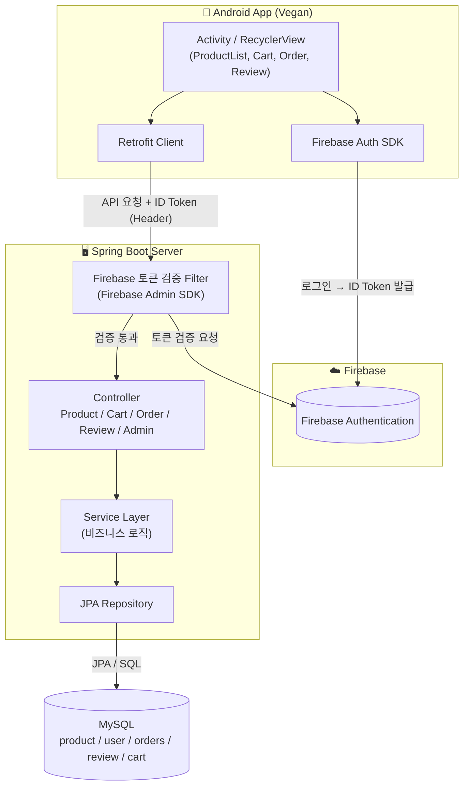

## 아키텍처

```mermaid
flowchart TB
    subgraph Android["📱 Android App (Vegan)"]
        UI["Activity / RecyclerView<br/>(ProductList, Cart, Order, Review)"]
        AuthSDK["Firebase Auth SDK"]
        Retrofit["Retrofit Client"]
    end

    subgraph FirebaseCloud["☁️ Firebase"]
        FBAuth[("Firebase Authentication")]
    end

    subgraph Backend["🖥️ Spring Boot Server"]
        Filter["Firebase 토큰 검증 Filter<br/>(Firebase Admin SDK)"]
        Controller["Controller<br/>Product / Cart / Order / Review / Admin"]
        Service["Service Layer<br/>(비즈니스 로직)"]
        Repo["JPA Repository"]
    end

    DB[("MySQL<br/>product / user / orders / review / cart")]

    UI --> AuthSDK
    AuthSDK -- "로그인 → ID Token 발급" --> FBAuth
    UI --> Retrofit
    Retrofit -- "API 요청 + ID Token (Header)" --> Filter
    Filter -- "토큰 검증 요청" --> FBAuth
    Filter -- "검증 통과" --> Controller
    Controller --> Service
    Service --> Repo
    Repo -- "JPA / SQL" --> DB
```
