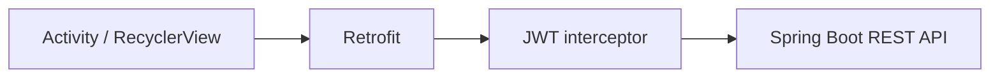

# Android application

Java/XML 기반 Android 클라이언트입니다. 초기 Firebase 직접 연동 구조에서 Retrofit 기반 Spring Boot API 연동 구조로 전환했습니다.



## API 주소

에뮬레이터의 기본 주소는 `http://10.0.2.2:8080/`입니다. 실제 기기나 다른 서버를 사용할 때는 Git에 커밋하지 않는 로컬 `gradle.properties`에 다음 값을 추가합니다.

```properties
VEGAN_API_BASE_URL=http://내-PC-IP:8080/
```

배포 환경에서는 HTTPS 주소를 사용해야 합니다.
